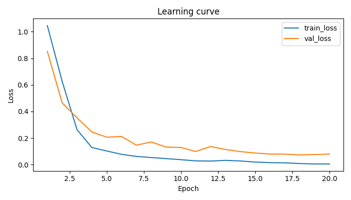
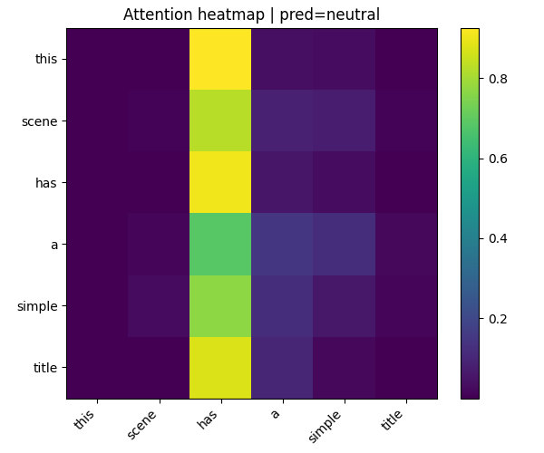
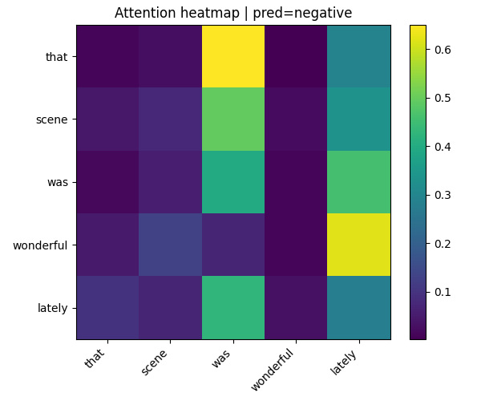
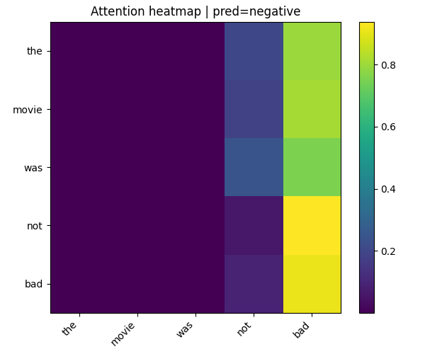

# 1. Thiết lập thực nghiệm

## 1.1. Quy trình thực hiện
Quy trình thực hiện: data_utils.py → model.py → train.py → visualize.py.

**Bảng 1. Quy trình thực nghiệm**

| Thứ tự | File | Lệnh chạy | Nội dung thực hiện |
| --- | --- | --- | --- |
| 1 | `data_utils.py` | `python data_utils.py --max_len 20 --show_stats` | Đọc dữ liệu gốc từ `data/sentiment_raw.csv`, tiền xử lý văn bản, xây dựng từ điển từ tập train, và lưu dữ liệu tensor vào `data/processed/`. |
| 2 | `model.py` | `python model.py` | Định nghĩa mô hình Transformer tự cài đặt, gồm `scaled_dot_product_attention`, `SelfAttention`, `FeedForwardNetwork`, `TransformerEncoderBlock` và lớp phân loại. |
| 3 | `train.py` | `python train.py --run_all` | Huấn luyện mô hình bằng Adam, chọn checkpoint tốt nhất theo validation accuracy, và ghi tổng hợp kết quả vào `results/summary.json`. |
| 4 | `visualize.py` | `python visualize.py --model results/model_Transformer_d128_ff256.pt --sentence "Sentence to classify" ` | Chọn mô hình đã huấn luyện và câu cần phân loại, xuất heatmap để phục vụ phân tích. |

Kết quả tiền xử lý bao gồm các tệp `data/processed/train.pt`, `val.pt`, `test.pt`, cùng `vocab.json` và `meta.json`, giúp các bước sau sử dụng đúng cùng một cấu hình đầu vào.

## 1.2. Các siêu tham số chính
**Bảng 2. Nhóm siêu tham số cố định**

| Siêu tham số | Giá trị |
| --- | --- |
| `max_len` | 20 |
| `batch_size` | 32 |
| `learning rate` | 1e-3 |
| `num_epochs` | 20 |
**Bảng 3. Các cấu hình mô hình được thử nghiệm**

| Cấu hình | `d_model` | `d_ff` |
| --- | --- | --- |
| Transformer #1 | 64 | 128 |
| Transformer #2 | 128 | 256 |
| Transformer #3 | 32 | 64 |
| Baseline MLP | 64 | - |
Baseline bắt buộc của đồ án là mô hình **MLP do giảng viên cung cấp**, được cài sẵn trong `train.py` và dùng làm mốc so sánh với các cấu hình Transformer.

## 1.3. Đảm bảo khả năng tái lập kết quả

Để kết quả có thể tái lập, thí nghiệm tuân thủ các nguyên tắc sau:

- Cố định `random seed = 42`.
- Sử dụng đường dẫn tương đối trong toàn bộ script.
- Cố định môi trường thư viện theo `requirements.txt`.

# 2. Kết quả thực nghiệm và so sánh

## 2.1. Kết quả các mô hình
**Bảng 4. Kết quả các mô hình**
| Mô hình | d_model | d_ff | Train Acc | Val Acc | Test Acc | Train Loss cuối |
| --- | --- | --- | --- | --- | --- | --- |
| Baseline MLP | - | - | 0.8762 | 0.7667 | 0.8111 | 0.5321 |
| Transformer #1 | 64 | 128 | 0.9905 | 0.9556 | 0.9778 | 0.0390 |
| Transformer #2 | 128 | 256 | 0.9976 | 0.9667 | 0.9778 | 0.0091 |
| Transformer #3 | 32 | 64 | 0.9167 | 0.8889 | 0.8444 | 0.1915 |

## 2.2. So sánh và lựa chọn mô hình tốt nhất
Từ bảng trên có thể thấy baseline MLP cho kết quả thấp nhất trên cả ba tập dữ liệu và train loss cuối. Cả ba cấu hình Transformer đều đạt kết quả tốt hơn rõ rệt (đặc biệt là Transformer #1 và Transformer #2), qua đó xác nhận hiệu quả của kiến trúc self-attention trong bài toán phân loại cảm xúc văn bản.

Mặc dù test accuracy của Transformer #1 và Transformer #2 bằng nhau (0.9778), Transformer #2 được xem là cấu hình tốt nhất khi đạt validation accuracy cao nhất là 0.9667 và train loss cuối cùng thấp nhất là 0.0091.

## 2.3. Learning curve và phân tích overfitting
Biểu đồ learning curve của cấu hình tốt nhất được thể hiện trong hình bên dưới. Quan sát cho thấy train loss giảm rất nhanh trong các epoch đầu và tiếp tục giảm đều về cuối quá trình huấn luyện. Validation loss cũng giảm theo xu hướng chung, nhưng dao động nhẹ ở một vài epoch giữa chừng. Dấu hiệu overfitting bắt đầu xuất hiện từ khoảng epoch 11–12 khi train loss tiếp tục giảm mạnh trong khi validation loss gần như chững lại và giảm chậm hơn. Tuy vậy, mức chênh lệch giữa train loss và val loss không quá lớn nên hiện tượng quá khớp chỉ ở mức nhẹ, chưa ảnh hưởng nhiều đến chất lượng mô hình cuối cùng.

**Hình 1. Learning curve của Transformer #2 (`d_model = 128`, `d_ff = 256`)**

## 2.4. Nhận xét tác động của d_model, d_ff
Kết quả thực nghiệm cho thấy khi tăng `d_model` và `d_ff` từ cấu hình nhỏ (32, 64) lên các cấu hình lớn hơn (64, 128) và (128, 256), độ chính xác trên validation và test được cải thiện rõ rệt. Điều này cho thấy mô hình có đủ dung lượng biểu diễn sẽ học tốt hơn đặc trưng ngữ nghĩa của dữ liệu.

Ngược lại, cấu hình quá nhỏ (Transformer #3) cho kết quả thấp hơn đáng kể trên cả train, val và test, phản ánh hiện tượng underfitting tương đối. Tóm lại, trong các cấu hình đã thử, Transformer #2 là phương án cân bằng tốt nhất giữa khả năng học, khả năng khái quát và độ ổn định khi huấn luyện.
# 3. Phân tích Attention

**Bảng 1 — Heatmap Attention (ví dụ 3 câu minh họa)**

Phần này trình bày 3 heatmap attention từ mô hình **Transformer d128_ff256** (mô hình tốt nhất đã lựa chọn ở trên) tương ứng với ba câu minh họa (1 câu dự đoán đúng trên tập Test, 1 câu dự đoán sai trên tập Test, 1 câu phủ định do nhóm thêm). Mỗi hàng gồm câu đầu vào, nguồn, nhãn thật, nhãn dự đoán và 2–3 câu nhận xét rút gọn.

| Câu | Loại câu | Nhãn thật | Nhãn dự đoán | Heatmap và Nhận xét |
|---|---|---|---|---|
| this scene has a simple title | Mô hình phân loại đúng   Câu dự đoán trong bộ Test | Neutral | Neutral |    Nhận xét: Attention tập trung vào các từ chỉ nội dung "scene" và "title", ít chú ý từ cảm xúc; vì vậy mô hình phân loại đúng là trung tính. |
| the film was pretty wonderful today | Mô hình phân loại sai   Câu dự đoán trong bộ Test | Positive | Negative |    Nhận xét: Heatmap cho thấy mô hình không nhấn đủ vào "wonderful" mà bị phân tán; cụm từ bổ nghĩa "pretty" hoặc các token chức năng có thể làm giảm ảnh hưởng của từ cảm xúc mạnh. |
| the movie was not bad | Mô hình phân loại sai   Câu có phủ định   Câu dự đoán ngoài bộ Test (Nhóm thêm ngoài) | Positive | Negative |    Nhận xét: Mô hình tập trung mạnh lên "bad" và ít chú ý tới "not"; điều này giải thích việc mô hình không đảo chiều ý nghĩa khi gặp phủ định, dẫn tới dự đoán sai. |

**Nhận xét chung:** Tổng quan, các heatmap cho thấy mô hình thường chú ý đúng vào các từ chỉ nội dung (ví dụ: "scene", "title") khi câu mang tính mô tả trung tính. Ở các câu cảm xúc, mô hình đôi khi bị phân tán attention (không tập trung đủ vào từ cảm xúc chính như "wonderful") hoặc bỏ qua các từ phủ định ("not"), dẫn tới dự đoán sai. Đây là dấu hiệu mô hình chưa nắm tốt cấu trúc ngữ cảnh phức tạp như phủ định và từ bổ nghĩa (ví dụ "pretty").

# 4. Error Analysis

Bắt buộc liệt kê 5–10 câu mô hình phân loại sai. Ở đây ưu tiên lấy câu từ `test` (khách quan), bổ sung thêm lỗi từ các mô hình khác khi model tốt nhất có ít lỗi, và có thể thêm 1–2 câu ngoài (out-of-sample) để kiểm tra phủ định.

| STT | Câu văn | Nhãn đúng | Nhãn dự đoán | Mô hình / Nguồn | Nhóm lỗi / Giải thích ngắn |
|---:|---|---:|---:|---|---|

